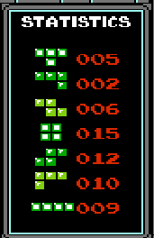
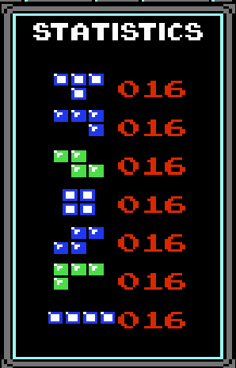
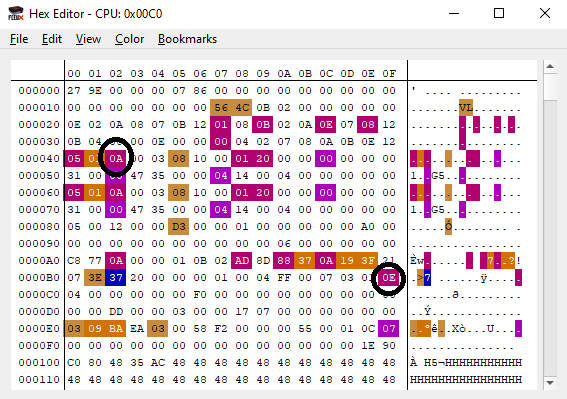

# Tetris: Fair Edition
This repo contains the patch for the NES Tetris game, which implements the mondern [7-Bag Random Generator](https://tetris.wiki/Random_Generator) instead of pure randomness.

## **Installation**  
To install the patch, follow these steps:
* Have a copy of the Tetris .NES file (*These steps will override the existing file, so make sure to copy the original if you wish to have a vanilla version of the ROM*)
* Download the patch `Tetris_7Bag.ips` from this repository
* Download [Lunar IPS](https://www.romhacking.net/utilities/240/), a program which can be used to apply the patch
* Run Lunar IPS
    * Select "Apply IPS Patch"
    * Locate the Tetris_7Bag.ips file
    * Next, Locate the vanilla Tetris .NES file (again, I suggest making a copy beforehand)
* Load the newly-patched ROM (.NES file) into your emulator of choice.

## Prologue
Perhaps the simplest explanation as to "why I created this patch", would come from this ancient two minute College Humor sketch: [The Tetris God](https://youtu.be/Alw5hs0chj0?si=YsJ_k8zRi9HjZ9mk)

Since you don't click every link you see, and you don't like fun, I shall summarize: the sketch takes the perspective of a Tetris god and his two angels, as the god decides which pieces to drop to the mortal below. As the game progresses, the mood shifts from optimism to despair, as the god drops more and more ill-fitting pieces.

  
   
  "There is no <i>place for a square</i>!"

This culminates to a point where the player desperately needs a line piece, which the god refuses to drop. Out of desperation, the player plugs the gap with an L piece - then the god drops line piece, line piece, line piece...

  
   
  "No... no, no..."

The player is punished for his hubris.

## Why The Patch Was Created

If the goal of modern Tetris is to beat opponents, the goal of NES Tetris was to get the high score. It's supposed to have random distribution, that's it's purpose. Now I, an interloper, and a moron, come along and remove the one thing that made this game unique from the rest. 

  
   
  <i>It was perfectly fine!</i>

To be honest, one day I was playing Tetris and I though "Hey, it would be cool to make a 7-bag patch" - and here we are. I won't be making some grand statement about how the game is better like with my other ([1](https://github.com/schil227/JourneyToSiliusFair),[2](https://github.com/schil227/FantasticAdventuresOfDizzyFair)) "Fair Edition" patches - it's Tetris.

## The Results
Pieces are dropped in an even distribution ¯\\\_(ツ)_/¯

  
   

That said, I'm still terrible. The change didn't make as much difference as I initially thought - though it's an improvement. I can bank on whether I know a line piece is coming, for example; and I'm sure people who are actually good at the game would get more out of it. Perhaps in the future I'll add some kinda "hold piece" feature, but for now, it's fine.

# Technical Aspects
I'm no whizz-bang 6502 Assembly expert; after a lengthy hiatus this marks my 3rd NES romhack project to date. And while it wasn't the largest, it is definitely the most complex. Unlike before when I was doing little modifications, to existing functions, here I actually had to create and implement some algorithms.

## The Goal
"Replace the existing random piece selection with an implementation of the 7-Bag Random Generator."

### Breaking it Down
Now, this has several caveats:
1. I need to find a place to store the "Bag of pieces"
1. I need to randomize that bag, so that each piece shows up once
1. I need to hook it into the existing logic at the right places

To do this, I needed to know several <i>bits</i> \*snorts\* of information:
1. What are the identifiers for the 7 tetrominos?
1. Where is the "current" piece stored?
1. Where is the "next" piece stored?
1. Where is the logic for picking the "next" piece, and setting the current piece?

## The work
### Investigation
As you can tell, a lot of this deals with <i>"where"</i>. The first step with any good romhacking adventure is to boot up FCEUX, and take a look at the RAM.

  
   
  (Note: This is not the original Tetris, but Tetris with the patch applied, so it looks a little different)

I circled two locations: $42 and $BF.

Technical aside: These both exist in what's called the "Zero Page", meaning the location in ram with starts with $00 (so, their absolute address is $0042 and $00BF). 6502 ASM has special opt-codes for interacting with this Zero Page block; since the high bits are known "00", it requires less cycles to access, thus a performance boost is gained.

The $4X region of ram contain the data concerning the current piece. $40 is where the piece is horizontally, $41 is where it is vertically, and $42 <i> is what the piece is!</i> In this case #0A indicates a square piece. In fact, here's a quick table of each of the piece values:

| Piece | Code  | 
|---|---|
| T | 02  |
| L*  |  07 |
| Z  |  08 |
| []  |  0A |
| S  |  0B |
| L  | 0E  |
| |  | 12  |

(*Reverse)

These values are actually not the identifiers of the pieces, persay, but the specific <i>orientation</i> of the piece. For example, #00 is also the T piece, but rotated. So really, there are 4 values which represent the T piece, but for whatever reason, #02 is the defacto identifier.

Speaking of, in $BF there is another identifier: #0E. This is actually the next piece.

You may have already noticed that the $6X row is identical to $4X. Indeed, these value are replicated each game cycle... I don't know why. Perhaps it has something to do with the way the game refreshes after each screen draw, or maybe it's a relic of the abandoned 2-player mode that almost was, I can't say. 

After finding these values out, I set breakpoints for when these addresses were used. After a bit of detective work, I found two important pieces of info:
 
 - At $98E1, The "next" piece ($BF) is randomly chosen, and (later) written to $42 after the piece drops
 - When the game starts, at $8724 it writes the initial "current" piece to $62

 With this data in-hand, I now had the task of designing and implementing the 7-Bag randomizer.

### Designing The Algorithm
Next came the biggest challenge; devise a way to randomize the 7 unique pieces.

Now, this is an interesting problem, one which has many different solutions. My first plan was to 
1. Store the 7 Tetris piece ids in memory
1. Take the random number (stored every cycle at $17), perform modulo N, where N is the number of pieces available
1. Remove that piece from the list, put it in the On Deck bag, and shift the list down (repeat until the On Deck bag is filled)
1. Set the On Deck bag as the Current bag.

Now, this is probably what I would've done had I coded it in a higher level language, however there's a lot of issues with this approach (those of you familiar with assembly can already spot a few of them). For 1, modulo is asking for a lot; it's not implemented, and it's very costly to do. For 2, I have <i>no idea </i> how performant this operation must be, and for that matter, if it will impact game play. Calling this algorithm every 7 piece drops might be too much, I don't know.

With those thoughts in mind, I pivoted my approach: instead of generating a new bag every 7 pieces, I would populate the On Deck bag immediately, and every piece drop, swap values in the bag depending on the random number. This worked well, because it was relatively economical (the On Deck bag is only traversed once, 7 elements, per drop cycle), and a new random number was used every time. 

This algorithm worked as follows:

1. The On Deck bag is initialized with 7 pieces
1. The player takes piece X out of the bag, where X is the index of the piece
    - For example, if the player takes their 3rd piece, the index would be 2
1. Load the random number from $17, and perform "Arithmetic Shift Left" on it 7 times.
    - As ASL is called, increment a second index Y (from 0 to 7)
1. For each `1` produced from ASL, swap the value at X with the value at index Y of the On Deck bag
1. Increment the index X
1. If X == 7, then 
    1. the On Deck bag is completely shuffled, so it replaces the Current bag
    1. X is reset to 0

While certainly complex, and perhaps overkill, this method gradually shuffles the pieces in the On Deck bag. This spreads the work over several game cycles, and produces a random bag.