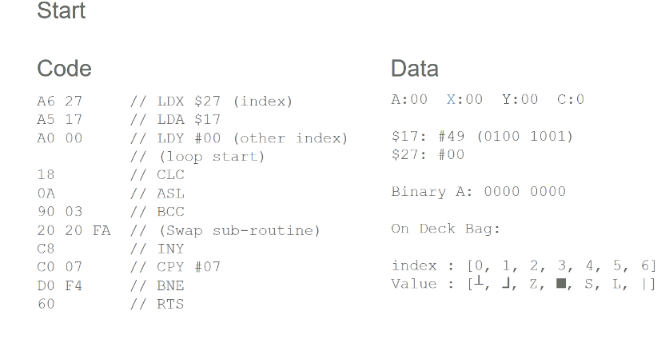
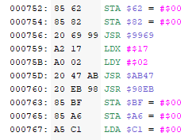
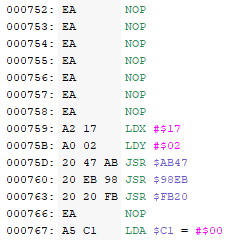
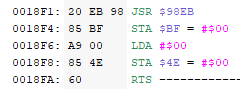
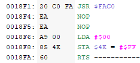
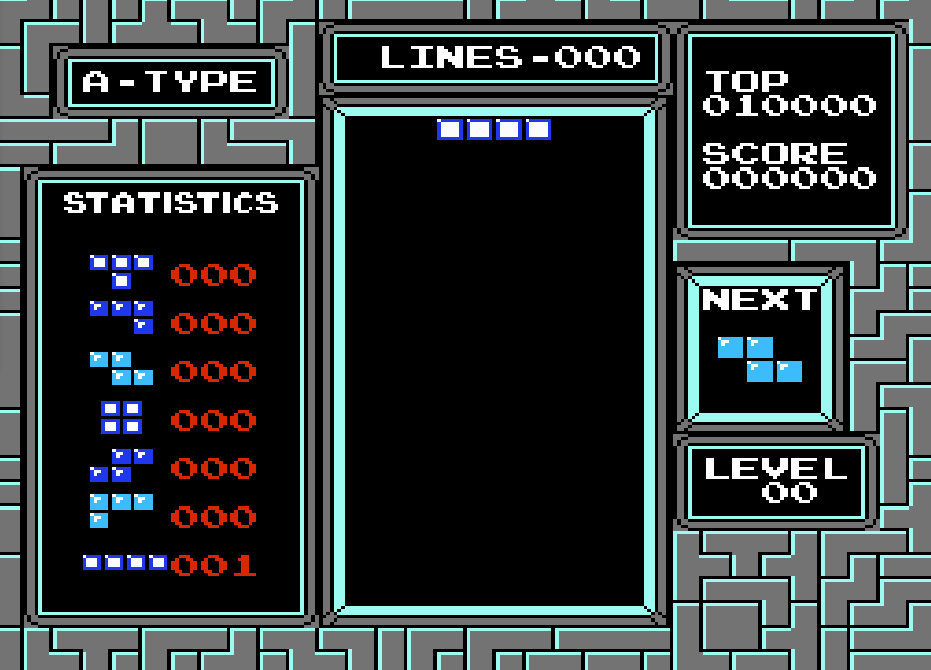

# Tetris: Fair Edition
This repo contains the patch for the NES Tetris game, which implements the mondern [7-Bag Random Generator](https://tetris.wiki/Random_Generator) instead of pure randomness.

## **Installation**  <a id="installation"></a>
To install the patch, follow these steps:
* Have a copy of the Tetris .NES file (*These steps will override the existing file, so make sure to copy the original if you wish to have a vanilla version of the ROM*)
* Download the patch `Tetris_7Bag.ips` from this repository
* Download [Lunar IPS](https://www.romhacking.net/utilities/240/), a program which can be used to apply the patch
* Run Lunar IPS
    * Select "Apply IPS Patch"
    * Locate the Tetris_7Bag.ips file
    * Next, Locate the vanilla Tetris .NES file (again, I suggest making a copy beforehand)
* Load the newly-patched ROM (.NES file) into your emulator of choice.

## Prologue
Perhaps the simplest explanation as to "why I created this patch", would come from this ancient two minute College Humor sketch: [The Tetris God](https://youtu.be/Alw5hs0chj0?si=YsJ_k8zRi9HjZ9mk)

Since you don't click every link you see, and you don't like fun, I shall summarize: the sketch takes the perspective of a Tetris god and his two angels, as the god decides which pieces to drop to the mortal below. As the game progresses, the mood shifts from optimism to despair, as the god drops more and more ill-fitting pieces.

<p align="center">
  
  <br>
  "There is no <i>place for a square</i>!"
</p>

This culminates to a point where the player desperately needs a line piece, which the god refuses to drop. Out of desperation, the player plugs the gap with an L piece - then the god drops line piece, line piece, line piece...

<p align="center">
  
  <br>
  "No... no, no..."
</p>

The player is punished for his hubris.

## Why The Patch Was Created

If the goal of modern Tetris is to beat opponents, the goal of NES Tetris was to get the high score. It's supposed to have random distribution, that's it's purpose. Now I, an interloper, and a moron, come along and remove the one thing that made this game unique from the rest. 

<p align="center">
  
  <br>
  <i>It was perfectly fine!</i>
</p>

To be honest, one day I was playing Tetris and I though "Hey, it would be cool to make a 7-bag patch" - and here we are. I won't be making some grand statement about how the game is better like with my other ([1](https://github.com/schil227/JourneyToSiliusFair),[2](https://github.com/schil227/FantasticAdventuresOfDizzyFair)) "Fair Edition" patches - it's Tetris.

## The Results
Pieces are dropped in an even distribution ¯\\\_(ツ)_/¯

<p align="center">
  
  <br>
</p>

That said, I'm still terrible. The change didn't make as much difference as I initially thought - though it's an improvement. I can bank on whether I know a line piece is coming, for example; and I'm sure people who are actually good at the game would get more out of it. Perhaps in the future I'll add some kinda "hold piece" feature, but for now, it's fine.

# Technical Aspects
I'm no whizz-bang 6502 Assembly expert; after a lengthy hiatus this marks my 3rd NES romhack project to date. And while it wasn't the largest, it is definitely the most complex. Unlike before when I was doing little modifications, to existing functions, here I actually had to create and implement some algorithms.

## The Goal
"Replace the existing random piece selection with an implementation of the 7-Bag Random Generator."

### Breaking it Down
Now, this has several caveats:
1. I need to find a place to store the "Bag of pieces"
1. I need to randomize that bag, so that each piece shows up once
1. I need to hook it into the existing logic at the right places

To do this, I needed to know several <i>bits</i> \*snorts\* of information:
1. What are the identifiers for the 7 tetrominos?
1. Where is the "current" piece stored?
1. Where is the "next" piece stored?
1. Where is the logic for picking the "next" piece, and setting the current piece?

## The work
### Investigation
As you can tell, a lot of this deals with <i>"where"</i>. The first step with any good romhacking adventure is to boot up FCEUX, and take a look at the RAM.

<p align="center">
  
  <br>
  (Note: This is not the original Tetris, but Tetris with the patch applied, so it looks a little different)
</p>

I circled two locations: $42 and $BF.

Technical aside: These both exist in what's called the "Zero Page", meaning the location in ram with starts with $00 (so, their absolute address is $0042 and $00BF). 6502 ASM has special opt-codes for interacting with this Zero Page block; since the high bits are known "00", it requires less cycles to access, thus a performance boost is gained.

The $4X region of ram contain the data concerning the current piece. $40 is where the piece is horizontally, $41 is where it is vertically, and $42 <i> is what the piece is!</i> In this case #0A indicates a square piece. In fact, here's a quick table of each of the piece values:

| Piece | Code  | 
|---|---|
| T | 02  |
| ⅃  |  07 |
| Z  |  08 |
| ■  |  0A |
| S  |  0B |
| L  | 0E  |
| |  | 12  |

These values are actually not the identifiers of the pieces, persay, but the specific <i>orientation</i> of the piece. For example, #00 is also the T piece, but rotated. So really, there are 4 values which represent the T piece, but for whatever reason, #02 is the defacto identifier.

Speaking of, in $BF there is another identifier: #0E. This is actually the next piece.

You may have already noticed that the $6X row is identical to $4X. Indeed, these value are replicated each game cycle... I don't know why. Perhaps it has something to do with the way the game refreshes after each screen draw, or maybe it's a relic of the abandoned 2-player mode that almost was, I can't say. 

After finding these values out, I set breakpoints for when these addresses were used. After a bit of detective work, I found two important pieces of info:
 
 - At $98E1, The "next" piece ($BF) is randomly chosen, and (later) written to $42 after the piece drops
 - When the game starts, at $8724 it writes the initial "current" piece to $62

 With this data in-hand, I now had the task of designing and implementing the 7-Bag randomizer.

### Designing The Algorithm
Next came the biggest challenge; devise a way to randomize the 7 unique pieces.

Now, this is an interesting problem, one which has many different solutions. My first plan was to 
1. Store the 7 Tetris piece ids in memory
1. Take the random number (stored every cycle at $17), perform modulo N, where N is the number of pieces available
1. Remove that piece from the list, put it in the On Deck bag, and shift the list down (repeat until the On Deck bag is filled)
1. Set the On Deck bag as the Current bag.

Now, this is probably what I would've done had I coded it in a higher level language, however there's a lot of issues with this approach (those of you familiar with assembly can already spot a few of them). For 1, modulo is asking for a lot; it's not implemented, and it's very costly to do. For 2, I have <i>no idea </i> how performant this operation must be, and for that matter, if it will impact game play. Calling this algorithm every 7 piece drops might be too much, I don't know.

With those thoughts in mind, I pivoted my approach: instead of generating a new bag every 7 pieces, I would populate the On Deck bag immediately, and every piece drop, swap values in the bag depending on the random number. This worked well, because it was relatively economical (the On Deck bag is only traversed once, 7 elements, per drop cycle), and a new random number was used every time. 

This algorithm worked as follows:

1. The On Deck bag is initialized with 7 pieces
1. The player takes piece X out of the bag, where X is the index of the piece
    - For example, if the player takes their 3rd piece, the index would be 2
1. Load the random number from $17, and perform "Arithmetic Shift Left" on it 7 times.
    - As ASL is called, increment a second index Y (from 0 to 7)
1. For each `1` produced from ASL, swap the value at X with the value at index Y of the On Deck bag
1. Increment the index X
1. If X == 7, then 
    1. the On Deck bag is completely shuffled, so it replaces the Current bag
    1. X is reset to 0

While certainly complex, and perhaps overkill, this method gradually shuffles the pieces in the On Deck bag. This spreads the work over several game cycles, and produces a random bag. To break the algorithm down into sub-routines (functions), it looks like this:

- InitShuffle7
  - load the initial piece data to the On Deck bag
  - Shuffle On Deck bag 7 times, copy it to the Current bag
  - Take two pieces from the current bag, for the current piece and next piece
- TakePiece
  - Take the next piece from the current bag at index X
  - Shuffle On Deck bag at index X
  - If the last piece was taken, copy On Deck to Current bag
- WriteOnDeck
  - Copies the On Deck bag over the Current "empty" bag
- Shuffle
  - Swap the places of pieces in On Deck bag with the current index, based on random number.
- Swap
  - Swaps two pieces in the bag

## The Code
### Swap
_Location: 007A50_

As simple as it gets; swap the pieces in the On Deck bag (that is, exchange the numerical values which represent the pieces). This is called from within the __Shuffle__ sub routine, which provides the following:

- Accumulator: currently holding the random number
- X: the root index to swap with
- Y: the other index to swap with

So that is to say, I know the indexes to swap, I just need to reference them by `$29 + index`, the offset of $29 being where the On Deck bag starts in memory.

```
85 37        // store acc at $37 // put down the random number for a second
B5 29        // load acc $29 + X
85 28        // store acc $28  // put X's value in $28 (temporary)
B9 29 00     // load acc $29 + Y  / load Y's value
95 29        // store acc $29 + X // overwite the X index
A5 28        // load acc $28  // load the initial X index value
99 29 00     // store acc $29 + Y // save X's value to Y's index
A5 37        // load acc $37 // pickup the (shifted) random number
60           // RTS (return to where this sub routine was called)
```

Technical aside: Something interesting about the opt codes here: B9 (LDA Abs+Y) and 99 (STA Abs+Y) are 3 Bytes each, and require more cycles than the X counterparts. This is because in 6502 Assembly, there aren't any opt codes for the Y register in the "Zero Page" space. This is apparently an intended design choice, and due to the limitations of the language itself.

Now, this also demonstrates temporary storage: I put the working value currently stored in the accumulator at empty address $37, because I need to make use of the accumulator register. Right before the sub routine finishes, I re-load it from $37 back into the accumulator. Thus, I have "guarded" the use of __Swap__ by temporarily storing a value in an empty location.

In hindsight, I think I could've used LDX/STX/LDY/STY instead of doing everything with the accumulator, but ¯\\\_(ツ)_/¯

### Shuffle
_Location: 007A80_

Possibly the most interesting code, this "shuffles" the On Deck bag by swapping pieces with the current "index". The idea is, we have a randomly shuffled the Current bag, so we can simply take the pieces one by one from start to finish - and the piece taken is at the "index". So, if the 4th piece is taken from Current, then the index is at (3), and we shuffle On Deck by swapping around pieces with the 3rd index. 

The code is as follows:

```
A6 27     // LDX $27, the index (e.g. 2) of the last piece taken from the bag (e.g. 0x20 + 2 -> 0x22, the 3rd piece)
A5 17     // LDA (zero page) 0x17, the random number
A0 00     // LDY (immediate) #00, sets Y to 0
          ; loop start
18        // CLC Clear carry flag
0A        // ASL (Arithmatic shift left of acc), popped digets set Clear Carry flag
90 03     // BCC (Branch Carry Clear) Jump over the sub routine if a 1 wasn't shifted into CC flag
20 20 FA  // JSR (go to swap sub routine)
C8        // Increment Y
C0 07     // Compare the value of Y with 7 - if they're the same, the zero flag is set
D0 F4     // BNE if y is != 7, then go back 12 instructions (to CLC)
60        // RTS (done - the on-deck bag has been shuffled once.)
```

Here's a gif to help illustrate what's going on at a low level:

<p align="center">
  
  <br>
</p>

This animation goes through the first two cycles of the algorithm, then "fast-forwards" to the final cycle where the sub routine ends. It helps to illustrate how the pieces are swapped by iterating over the random value. 

Every time a new piece is taken, this sub routine is invoked, which gives each index 7 chances to be swapped with another random index. This makes for a thoroughly mixed bag, while evenly distributing the randomization "load" across many in-game cycles, and with a new random number every time.

### WriteOnDeck
_Location: 007AB0_

Called from within the __TakePiece__ sub routine, this simply writes the On Deck bag (located from $29 to $36 in memory) to the Current bag ($20 to $26). It's a relatively simple loop.

```
A2 00     // LDX #00
B5 29     // LDA $29+x, load the on-deck index value to Acc
95 20     // STA $20+x, store it to current bag at index
E8        // INX x++
E0 07     // compare X to 7
D0 F7     // If x != 7, go back to LDA $29+x step
60        // RTS; the OnDeck bag has been written to Current Bag
```

### TakePiece
_Location: 007AD0_

This sub routine gets invoked when a new tetris piece is taken. That is; the "Next" piece at $BF is copied to the "Current" piece ($42/$62), and we need the next piece from the Current bag to take the place of $BF.

To accomplish, __TakePiece__ does a few things:
 - It keeps track of the Index of the Current Bag (stored at $27)
 - It shuffles the On Deck bag (see __Shuffle__)
 - If it has taking the 7th piece of the Current Bag, replace the current bag with the On Deck bag (see __WriteOnDeck__)

```
A6 27        // LDX $27       // Load the "index" from $27
B5 20        // LDA $20 + X   // Load the bag value (start + index) into Acc
85 BF        // STA $BF       // Store the value at $BF
20 70 FA     // JSR 70 FA     // Jump to the shuffle sub routine
E8           // INX           // Increment X
86 27        // STX $27       // Store the value of the index in $27
E0 07        // CMX 07        // Compare the value of X to #07
D0 07        // BNE 07        // If X != #07, skip WriteOnDeck and index reset 
20 A0 FA     // JSR A0 FA     // Jump to WriteOnDeck sub routine
A9 00        // LDA 00        // Store #00 in Acc
85 27        // STA 27        // Store 00 in $27, resetting the index
60           // RTS           // Return
```

### TakePieceGuardian
_Location: 007B00_

__TakePieceGuardian__ is kinda the Demilitarized Zone between "my code" and "their code". I understand "my code", and I know what my code is going to do: It's going to use the Acc/X/Y registers. I have no idea what "their code" is doing. 

Somewhere in the opt-code soup, I need to call my __TakePiece__ sub routine. And without _a lot_ of investigation, I cannot be sure what their code is doing. What registers are they using? Does that Carry flag need to be preserved? I certainly hope not.

After analyzing the code for a bit, I decided to preserve the registers before calling __TakePiece__, and restore then afterword. It was probably unnecessary, but it's better than causing some unintended side-effect.

```
85 30    // STA $30     // Store Acc at $30
86 31    // STX $31     // Store X at $31
84 32    // STY $32     // Store Y at $32
20 C0 FA // JSR C0 FA   //(Take piece sub routine)
A4 32   // LDY $32     // Load Y from $32
A6 31   // LDX $31     // Load X from $31
A5 30   // LDA $30     // Load Acc from $30
60      // RTS         // (done)

```
### InitShuffle7
_Location: 007B30_

Finally, we have the biggest and dumbest sub routine for last.

When a new game is started (after navigating the menus, etc.), we need to initialize the bags. The Current bag needs to be sufficently randomized, and we take two pieces from it right away; the "current" piece and the "next" piece. This is done by:
 - "manually" shuffling the On Deck bag 7 times
 - Calling __TakePiece__, then immediately assigning the value to the "Current" piece
 - Calling a special "their code" sub routine to increment the piece counter
 - Then calling __TakePiece__ again to set the "Next" piece.

```
85 30     // STA $30     // Store Acc at $30
86 31     // STX $31     // Store X at $31
84 32     // STY $32     // Store Y at $32
20 20 FA  // Initialize Bags
20 C6 FA  // Shuffle #1
20 C6 FA  // Shuffle #2
20 C6 FA  // Shuffle #3
20 C6 FA  // Shuffle #4
20 C6 FA  // Shuffle #5
20 C6 FA  // Shuffle #6
20 C6 FA  // Shuffle #7 - Current bag now randomized
20 C0 FA  // TakePiece -> index 0 written to $BF
A5 BF     // Load $BF into Acc
85 42     // Write Next piece to current piece
85 62     // Write Next piece to current piece (other spot)
85 82     // Write Next piece to $82 (for some reason)
20 69 99  // Call the Piece count SR
20 C0 FA  // TakePiece -> index 1 written to $BF; all set up now!
A4 32     // LDY $32     // Load Y from $32
A6 31     // LDX $31     // Load X from $31
A5 30     // LDA $30     // Load Acc from $30
60        // RTS
```

Again, this sub routine is guarded; Acc/X/Y are stored before and loaded after this sub routine completes.

Note that the `Shuffle #X` calls are actually calling into the middle of __TakePiece__, specifically to the line which invokes the __Shuffle__ sub routine. This is because after the shuffle, X is incremented, and once it hits 7, it automatically calls __WriteOnDeck__.

### Wiring it up
These are some nice functions and all; but how do they get called? The answer is, one must investigate where the functions need to be called, then perform some surgery. This isn't like working with a "higher-level" programming language; I can't just make some space and call my function. Instead, I must overwrite existing opt codes to jump to "my code". Sometimes this sucks, but fortunately this time I was able make some room.

#### Initializing the bags:

_Location: 000752_

| <p style="text-align: center;">Before</p> | <p style="text-align: center;">After</p> |
|---|---|
| <br/>| |

In this case, there was ample room to jump to the init sub routine (see 000763) because I had to get rid of the old call to set the "Next" piece ($BF). But also in addition to that, I had to get rid of a bunch of stuff before it, which was setting the current piece ($62) _and_ incrementing the piece counter of said current piece ($82, and the following `JSR $9969`). Instead, that's all being handled in the __InitShuffle7__ sub routine.

#### Setting the "Next" piece:

_Location: 0018F1_

| <p style="text-align: center;">Before</p> | <p style="text-align: center;">After</p> |
|---|---|
| <br/>| |

Here, `JSR $98EB` (a call to the old randomization sub routine) could be replaced with a call to __TakePiece__, and `STA $BF` could be NOP'd.

All in all, fairly painless.

# Conclusion
I succeeded in doing what I attempted; for better or worse, there exists a 7-Bag Random Generator for NES Tetris. Nobody asked for it, and I did not improve my Tetris skills like I thought it would, but oh well ¯\\\_(ツ)_/¯

This was a particularly fun project. At first I was hesitant; I thought getting back into the saddle of 6502 and wandering blindly through opt codes was gonna be too hard, but it actually was really enjoyable. The uptick in difficultly felt natural, and it was fun to code with such bizarre restrictions (e.g. no `%`). I realize how much I take for granted at my day job, but also how much more... idk, artisanal? programming can be. It was fun, and I already have plans for my next (significantly more meaningful) Fair Edition.

Final note: About half-way through my work, I realized that the demo probably wouldn't handle the changes too well. Once I finally wired everything up and gave it a go, I was not disappointed.

<p align="center">
  
</p>
